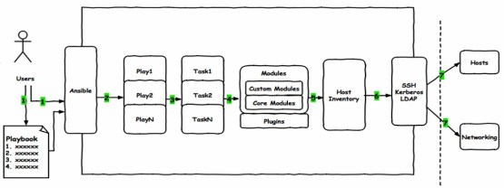

- [### Playbook](#-playbook)
    - [1.1 playbook介绍](#11-playbook介绍)
    - [1.2 YAML语言](#12-yaml语言)
    - [1.3 Playbook 核心元素](#13-playbook-核心元素)
      - [1.3.1 host 组件](#131-host-组件)
      - [1.3.2 remote_user](#132-remote_user)
      - [1.3.3 task列表和action组件](#133-task列表和action组件)
      - [1.3.4 其他组件](#134-其他组件)
      - [1.3.5 shell脚本 vs playbook](#135-shell脚本-vs-playbook)
  - [2.2 playbook 命令](#22-playbook-命令)
  - [2.3 Playbook初步](#23-playbook初步)
    - [2.3.1 创建mysql用户](#231-创建mysql用户)
    - [2.3.2 利用playbook安装nginx](#232-利用playbook安装nginx)
  - [2.4 handlers和notify](#24-handlers和notify)
  - [2.5 tags组件](#25-tags组件)
  - [2.6 Playbook 变量](#26-playbook-变量)
  - [3.1Playbook的高级用法模板](#31playbook的高级用法模板)
    - [3.1.1 jinja2语法](#311-jinja2语法)
    - [3.1.2 template使用](#312-template使用)
    - [3.1.3 for循环：](#313-for循环)
    - [3.1.4 if 判断](#314-if-判断)
    - [3.1.5 when](#315-when)
    - [3.1.6 迭代 with_items](#316-迭代-with_items)
### Playbook ###
---
[Last modification date：2000/10/24]

#### 1.1 playbook介绍 ####

 
 Playbook：

+ 一个或多个 Play组成
+ 功能：预定义的一组主机，装扮成事先通过ansible中的task定义好的角色，Task调用ansible的一个module
+ YAML语言编写

#### 1.2 YAML语言 ####

可读性非常高，k8s也使用yaml语言

YAML：标记语言

**（1）语法简介：**

+ `单一文件`:选择性  三个`-`开始；`...`结束 （可以在一个文件写多个yaml）
+ 缩进统一、区别大小写
+ key/value：同行或分行
+ value：字符串、布尔等
+ 一个完整的代码块必须包含：name、task
+ 一个name只能包含一个task
+ 拓展名：yaml、yml

**（2）List列表：**

列表：由多个元素组成，且所有元素前以 `-` 打头

如：

```yaml
- name: Install a list of packages
  yum:
    name:
      - nginx
      - postgresql
      - postgresql-server  # 也可写为 [nginx,postgresql,postgresql-server]
    state: present
```

**（3）Dictionary 字典**

通常由多个key和value构成，注意格式

```yaml
name: tom
job: it
skill: c++
# 可以放置在{ }中进行表示，用，分割多个key:value
{name: "tom",job: "it",skill: "c++"}
```

列表中可嵌入字典


#### 1.3 Playbook 核心元素 ####

+ Hosts：被控节点列表
+ Tasks：任务集
+ Variables：内置变量或自定义变量在playbook调用
+ Templates：模板，可替换模板文件中的变量，并实现一些简单逻辑的文件
+ Handlers 和 notfiy 结合使用，由特定条件触发（满足、不满足）
+ tags 标签指定某条任务的执行，选择运行部分代码。自动跳过没有变化的部分。

##### 1.3.1 host 组件 #####

hosts：playbook目的让指定的被控节点执行任务，hosts指定被控节点有哪些。

```YAML
- hosts: db
```

##### 1.3.2 remote_user #####

指定远程执行任务的用户（可不写）

+ 可以配合sudo切换用户

```yaml
- hosts: db
  remote_user: root
  tasks:
    - name: test
      ping:
      remote_user: xx
      sudo: yes		# 默认 root
      sudo_user: yy
```

##### 1.3.3 task列表和action组件 #####

调用模块：两种语法

1. action：模块名 参数
2. module：参数 `推荐方法`

注意：shell和command模块后跟命令

```YAML
---
- hosts: db
  remote_user: root
  tasks: 
    - name: install httpd
      yum: 
        name: httpd
        state: present
    - name: start httpd
      service:
        name: httpd
        state: started
        enabled: yes
```

##### 1.3.4 其他组件 #####

某任务的状态运行后为changed时，可以通过`notify`通知给相应的handlers

任务可以通过`tags`打标签，可在ansible-playbook命令上使用 -t 指定进行调用


##### 1.3.5 shell脚本 vs playbook #####

shell脚本

```SH
#!/bin/sh
yum install httpd -y &>/dev/null
cp /tmp/httpd.conf /etc/httpd/conf/httpd.conf
cp /tmp/vhosts.conf /etc/httpd/conf.d/
systemctl enable --now httpd
```

playbook实现

```yaml
---
- hosts: db
  remote_user: root
  tasks: 
    - name: install httpd
      yum: 
        name: httpd
        state: present
    - name: copy file1
      copy: 
        src: /tmp/httpd.conf
        dest: /etc/httpd/conf/httpd.conf
    - name: copy file2
      copy: 
        src: /tmp/vhosts.conf 
        dest: /etc/httpd/conf.d/
    - name: start httpd
      service:
        name: httpd
        state: started
        enabled: yes
```

无需手动将文件复制到远程

### 2.2 playbook 命令 ###

格式：

ansible-playbook <filename> [options]

常见选项

+ `-C（大C）`： - -check 只检测可能发生的改变，`不真正执行`
+ `--list-hosts`：列出被控节点
+ `--list-tags`：列出tag
+ `--limit db`：只针对dn组的被控节点执行
+ `-v -vv -vvv`：详细信息


### 2.3 Playbook初步 ###

#### 2.3.1 创建mysql用户 ####

mysql_user.yaml

```yaml
---
- name: dbsrvs
  hosts: db
  remote_user: root
  
  tasks:
    - name: create mysql group
      group:
        name: mysql
        system: yes
        gid: 306
        state: present
    - name: create mysql user
      user:
        name: mysql
        comment: mysql
        shell: /sbin/nologin
        system: yes
        uid: 306
        group: mysql
        home: /data/mysql
        create_home: no
```

参考：

```SH
[root@master playbook]# ansible-galaxy collection install community.mysql:3.5.0 --force
Process install dependency map
Starting collection install process
Installing 'community.mysql:3.5.0' to '/root/.ansible/collections/ansible_collections/community/mysql'
You have new mail in /var/spool/mail/root
```

#### 2.3.2 利用playbook安装nginx ####

install_nginx.yaml

```yaml
---
- hosts: db
  remote_user: root
  gather_facts: no
  
  tasks: 
    - name: install httpd
      yum: 
        name: httpd
        state: present
    - name: start httpd
      service:
        name: httpd
        state: started
        enabled: yes
```


### 2.4 handlers和notify ###

角色：多个playbook的集合，实现复杂的项目

https://galaxy.ansible.com/

下载：他人写好的角色 	`/root/.ansible/roles`


Handlers本质是 task list，类似于MySQL中的触发器触发的行为，其中task与前描述的task并没有本质上的不同，主要用于当关注的资源发生变化时，才会采取一定的操作。而Notfy对应的action可用于在每个play的最后被触发，这样可以避免发生时每次都执指定的操作，仅在所有的变化发生完成后一次性地执行指定操作。在notify中列出的操作称为handler。即notify中调用handler中定义的操作。

如果配置文件发生更改，触发重新启动操作！

示例：

```YAML
---
- hosts: db
  remote_user: root
  
  tasks: 
    - name: install httpd
      yum: 
        name: httpd
        state: present
    - name: copy file1
      copy: 
        src: /tmp/httpd.conf
        dest: /etc/httpd/conf/httpd.conf
        notify: restart httpd				# notify 调用 handlers
    - name: copy file2
      copy: 
        src: /tmp/vhosts.conf 
        dest: /etc/httpd/conf.d/
        notify: 
          - restart httpd
          - Check Nginx Process
    - name: start httpd
      service:
        name: httpd
        state: started
        enabled: yes
 handlers:								# handlers
   - name: restart httpd
     service: 
       name: httpd 
       state: restarted
   - name: Check Nginx Process
     shell: kill -0 nginx &> /tmp/nginx.log
```

第一次也会触发：只要发生了改变行为就会触发

注意：handlers、notify 可以有多个


### 2.5 tags组件 ###


在playbook文件中，可以利用tags组件，为特定task指定标签，挡在执行playbook时，可以只执行tags的task，而非整个playbook文件

示例：

```yaml
---
- hosts: db
  remote_user: root
  
  tasks: 
    - name: install httpd
      yum: 
        name: httpd
        state: present
    - name: copy file1
      copy: 
        src: /tmp/httpd.conf
        dest: /etc/httpd/conf/httpd.conf
        tags: conf
    - name: copy file2
      copy: 
        src: /tmp/vhosts.conf 
        dest: /etc/httpd/conf.d/
    - name: start httpd
      service:
        name: httpd
        state: started
        enabled: yes
```

执行：`-t`：选择特定标签执行

`–list-tag`：列出所有标签

```SH
ansible-playbook -t conf httpd.yaml
```

### 2.6 Playbook 变量 ###

变量名：字母开头、字母数字下划线组成。

变量名：`anme=value` 如： `http_port=80`

变量调用方式：

通过`{{ variable_name}}` 调用变量，且变量名前后建议加空格，有时用”{{ variable_name }}“才生效

数据来源：

1. ansible 的setup facts 远程主机的所有变量都可直接调用 `ansible db -m setup`

```yaml
ansible db -m setup  -a 'filter=ansible_distribution_major_version'

---
- hosts: db

  tasks:
    - name: var
      file:
        name: /data/{{ ansible_nodename }}.log
        state: touch
```

注意：ansible命令不能直接使用变量，ansible-playbook可以

2. 通过命令行指定变量，优先级最高 	`-e` 

```SH
ansible-playbook -e varname-value
```

3. 在playbook文件中定义

```yaml
vars:
  - var1: value1
  - var2: value2
```

4. 在独立的变量yaml文件中定义

使用变量文件：

可以在一个独立的 playbook文件中定义变量，在另一个playbook文件中引用变量文件中的变量，比playbook中定义的变量优先级较高。

```SH
# cat vars.yaml
---
pack_name: vsftpd
service_name: vsftpd

---
- hosts: db
  remote_user: root
  vars_files:
    - /root/playbook/vars.yaml     #可以是路径如：/root/vars.yaml

# vim install_app.yaml
  tasks:
    - name: install package
      yum: 
        name: "{{ pack_name }}"
        state: present
    - name: start service
      service:
        name: "{{ service_name }}"
        state: started
        enables: yes
```

5.主机清单文件中定义变量

在`inventory`主机清单文件中为指定的主机定义变量以便于在playbook中使用

(1) 主机变量 - 单个主机

范例：

```SH
[db]
192.168.31.202 http_port=80
```

（2）组变量

在invertory主机清单中赋予给指定组内所有主机上的在playbook中可用的变量

示例：

```sh
[db]
192.168.31.202

[db:vars]
http_port=80
```

注意：针对主机的优先级更高。


### 3.1Playbook的高级用法模板 ###

template 模板

模板是一个文本文件，可以作为生成文件的模板，并且模板文件中还可以嵌套jinja语法

#### 3.1.1 jinja2语法 ####

文本文件，嵌套有脚本（使用模板编程语言编写） 借助模板生成真正的文件
Jinja2语言，使用字面量，有下面形式
    字符串：使用单引号或双引号
    数字：整数，浮点数
    列表：[item1, item2, ...]
    元组：(item1, item2, ...)
    字典：{key1:value1, key2:value2, ...}
    布尔型：true/false
算术运算：+, -, *, /, //, %, **
比较操作：==, !=, >, >=, <, <=
逻辑运算：and，or，not
流表达式：For，If，When


**自变量：**

1. 表达式最简单的形式就是字面量。字面量表示诸如字符串和数值的 Python对象。如“Hello World”
       双引号或单引号中间的一切都是字符串。
2. 无论何时你需要在模板中使用一个字符串（比如函数调用、过滤器或只是包含或继承一个模板的参数），如4242.23
3. 数值可以为整数和浮点数。如果有小数点，则为浮点数，否则为整数。在Python 里， 42 和 42.0 是不一样的

**算术运算**

```
Jinja 允许你用计算值。这在模板中很少用到，但为了完整性允许其存在
支持下面的运算符
    +：把两个对象加到一起。
       通常对象是素质，但是如果两者是字符串或列表，你可以用这 种方式来衔接它们。
       无论如何这不是首选的连接字符串的方式！连接字符串见 ~ 运算符。 {{ 1 + 1 }} 等于 2
    -：用第一个数减去第二个数。 {{ 3 - 2 }} 等于 1
    /：对两个数做除法。返回值会是一个浮点数。 {{ 1 / 2 }} 等于 {{ 0.5 }}
    //：对两个数做除法，返回整数商。 {{ 20 // 7 }} 等于 2
    %：计算整数除法的余数。 {{ 11 % 7 }} 等于 4
    *：用右边的数乘左边的操作数。 {{ 2 * 2 }} 会返回 4 。
       也可以用于重 复一个字符串多次。{{ ‘=’ * 80 }} 会打印 80 个等号的横条
    `**`：取左操作数的右操作数次幂。 {{ 2`**`3 }} 会返回 8
```

比较操作符

```
== 比较两个对象是否相等
!= 比较两个对象是否不等
> 如果左边大于右边，返回 true
>= 如果左边大于等于右边，返回 true
< 如果左边小于右边，返回 true
<= 如果左边小于等于右边，返回 true

逻辑运算符
对于 if 语句，在 for 过滤或 if 表达式中，它可以用于联合多个表达式
and
    如果左操作数和右操作数同为真，返回 true
or
    如果左操作数和右操作数有一个为真，返回 true
not
    对一个表达式取反（见下）
(expr)
    表达式组

['list', 'of', 'objects']:
一对中括号括起来的东西是一个列表。列表用于存储和迭代序列化的数据。
例如 你可以容易地在 for循环中用列表和元组创建一个链接的列表
    <ul>
    
        <li><a href="{{ href }}">{{ caption }}</a></li>
    
    </ul>
    ('tuple', 'of', 'values'):

元组与列表类似，只是你不能修改元组。
如果元组中只有一个项，你需要以逗号结尾它。
元组通常用于表示两个或更多元素的项。更多细节见上面的例子
    {'dict': 'of', 'key': 'and', 'value': 'pairs'}:

Python 中的字典是一种关联键和值的结构。
键必须是唯一的，并且键必须只有一个 值。
字典在模板中很少使用，罕用于诸如 xmlattr() 过滤器之类
    true / false:
    true 永远是 true ，而 false 始终是 false
```

#### 3.1.2 template使用 ####

template功能：根据模块文件动态生成对应的配置文件
+ template文件必须存放于templates目录下，且命名为 .j2 结尾
+ yaml/yml 文件需和templates目录平级，目录结构如下：

    ./
     ├── temnginx.yml
     └── templates
        └── httpd.conf.j2

示例：

利用template 同步httpd配置文件

+ 准备templates/httpd.conf.j2文件

```yaml
- hosts: db
  remote_user: root

  tasks:
    - name: install
      yum:
        name: httpd
        state: latest
    - name: template config to remote hosts
      template:
        src: httpd.conf.j2
        dest: /var/www/html/index.html
        backup: yes
    - name: start service
      service:
        name: httpd
        state: started
```

templates文件：

意义并不在与：直接将文件拷贝过来，而是进行一些处理、判断

```SH
hostname = {{ansible_nodename}}
```

templates可以算数运算但是使用最多的是`判断 if when `


结合 `notify`使用：

+ 实现了配置文件修改，重启服务

```yaml
---
- hosts: db
  remote_user: root

  tasks:
    - name: install
      yum:
        name: httpd
        state: latest
    - name: template config to remote hosts
      template:
        src: httpd.conf.j2
        dest: /var/www/html/index.html
        backup: yes
        notify: restart httpd
    - name: start service
      service:
        name: httpd
        state: started

  handlers:
    - name: restart httpd
      service:
        name: httpd
        state: restarted
```


#### 3.1.3 for循环：

```SH
[root@matser test]# tree
.
├── install_httpd.yaml
└── templates
    └── httpd.web.j2

```

文件：`install_httpd.yaml`

```SH
---
- hosts: db
  remote_user: root
  vars:
    httpd_web:
      - a
      - b
      - c

  tasks:
    - name: install
      yum:
        name: httpd
        state: latest
    - name: template config to remote hosts
      template:
        src: httpd.web.j2
        dest: /var/www/html/index.html
        backup: yes
    - name: start service
      service:
        name: httpd
        state: started
```

文件：`templates/httpd.web.j2`

```jinja2

server {
  data: {{ data }}
}
{% endfor %
```

==如果是k:v 键值对==

（1）单行

```yaml
- hosts: db
  remote_user: root
  vars:
    httpd_web:
      - a: 1
```

文件：`templates/httpd.web.j2`

```jinja2

server {
  data: {{ data.a }}
}

```

（2）多参

```yaml
---
- hosts: db
  remote_user: root
  vars:
    httpd_web:
      - listen: 80
        servername: "web1.com"
      - listen: 8080
        servername: "web2.com"
      - {listen: 8888,servername: "web1.com"}
```

j2文件：

```jinja2

server {
  listen {{ data.listen }}
  servername {{ data.servername }}
}

```

结果：

```SH
server {
  listen 80
  servername web1.com
}
server {
  listen 8080
  servername web2.com
}
server {
  listen 8888
  servername web1.com
}
```

#### 3.1.4 if 判断

> 使for更灵活

```yaml
---
- hosts: db
  remote_user: root
  vars:
    httpd_web:
      - web1:    # 对应的值为控制，相当于只有两个键值对；
        listen: 80
        root: "/var/www/web1"
      - web2:
        listen: 8080
        servername: "www.web2.com"
        root: "/var/www/web2"
      - web3:
        listen: 8080
        server_name: "www.web3.com"
        root: "/var/www/web3"
  tasks:
    - name: install
      yum:
        name: httpd
        state: latest
    - name: template config to remote hosts
      template:
        src: httpd.web.j2
        dest: /var/www/html/index.html
        backup: yes
    - name: start service
      service:
        name: httpd
        state: started
```

可以根据键值对的值、数量等条件判断。生产语句块

if:

```SH
 # defined : 存在生产，不存在不生成
 # ==
```

#### 3.1.5 when

when语句（当...满足时）可以实现条件测试，如果需要根据变量、facts或此前任务的执行结果来作为某stak执行与否的前提时，要用到条件测试咋样task后添加when字句，即可使用条件测试mjinja2语法格式。

https://galaxy.ansible.com/buluma/mysql

```yaml
---
- hosts: db
  remote_user: root
  tasks:
  - name: system
    shell: touch /data/1.txt
    when:
      - ansible_userspace_architecture == "x86_64"
```

常用方法：is defined 判断


#### 3.1.6 迭代 with_items

迭代：当有需要重复性执行任务时，可以使用迭代机制。

对迭代项的引用，固定变量名为“item”

要在task中使用with_items给定要迭代的元素列表

> for、if 在jinja2中使用。when和with_items在playbook中使用。

**元素列表格式：**

+ 字符串
+ 字典

示例：

```yaml
---
- hosts: web
  remote_user: root

  tasks:
  - name: file
    file:
      path: "/root/{{ item }}"
      state: touch
    with_items:
      - ib_logfile0
      - ib_logfile1
```

```YAML
---
- hosts: web
  remote_user: root

  tasks:
  - name: install
    yum:
      name: "{{ item }}"
      state: present
    with_items:
      - httpd
      - nginx
      - tree
```

创建用户：

```yaml
---
- name: Ensure MySQL users are present.
  mysql_user:
    name: "{{ item.name }}"
    host: "{{ item.host | default('localhost') }}"
    password: "{{ item.password }}"
    priv: "{{ item.priv | default('*.*:USAGE') }}"
    state: "{{ item.state | default('present') }}"
    append_privs: "{{ item.append_privs | default('no') }}"
    encrypted: "{{ item.encrypted | default('no') }}"
  #with_items: "{{ mysql_users }}"
  with_items:
    - { name: 'mysql', password: 'zzz'}
    - { name: 'tom', password: 'zzz'}
```

